# AWS Serverless Medallion Pipeline

An event-driven data ingestion engine for e-commerce and fintech workloads. Raw synthetic events are validated, deduplicated via atomic DynamoDB locks, and progressively refined through Bronze → Silver → Gold S3 layers using PySpark on AWS Glue, with final delivery to Snowflake via Snowpipe.

The pipeline is fully serverless, idempotent by design, and 100% defined as Infrastructure as Code with Terraform.

---

## Architecture

```mermaid
flowchart LR
    GEN["🐍 event_generator.py\n(Faker)"]
    BRONZE["S3 Bronze\nraw/ *.json"]
    SQS["Amazon SQS\nIngestion Queue"]
    DLQ["SQS DLQ"]
    LAMBDA["AWS Lambda\nValidator\n(Pydantic v2)"]
    DYNAMO["Amazon DynamoDB\nIdempotency Table\n(TTL + CAS)"]
    SILVER_S3["S3 Silver\nvalidated/ *.json"]
    GLUE_BS["AWS Glue\nbronze→silver\n(PySpark)"]
    SILVER_PARQUET["S3 Silver\nParquet (partitioned)"]
    GLUE_SG["AWS Glue\nsilver→gold\n(PySpark)"]
    GOLD["S3 Gold\nFeature Aggregates"]
    SNOWPIPE["Snowpipe\n→ Snowflake"]

    GEN -->|"PUT raw/*.json"| BRONZE
    BRONZE -->|"S3 Event Notification"| SQS
    SQS -->|"maxReceiveCount=3"| DLQ
    SQS -->|"Batch trigger\n(ReportBatchItemFailures)"| LAMBDA
    LAMBDA <-->|"CAS acquire_lock\nmark_succeeded\nmark_failed"| DYNAMO
    LAMBDA -->|"validated/*.json"| SILVER_S3
    SILVER_S3 -->|"Glue Job Bookmark"| GLUE_BS
    GLUE_BS -->|"Parquet + partitioned\nby date/event_type"| SILVER_PARQUET
    SILVER_PARQUET -->|"Glue Job Bookmark"| GLUE_SG
    GLUE_SG -->|"User-level\nfeature aggregates"| GOLD
    GOLD -->|"Auto-ingest"| SNOWPIPE
```



---

## Tech Stack

| Layer | Technology |
|---|---|
| Language | Python 3.12+ (Pydantic v2, boto3) |
| Validation | AWS Lambda (Python 3.12 runtime) |
| Messaging | Amazon SQS + DLQ |
| Idempotency | Amazon DynamoDB (TTL + conditional writes) |
| Storage | Amazon S3 (Bronze / Silver / Gold) |
| Processing | AWS Glue 4.0 (PySpark) |
| IaC | Terraform ≥ 1.7 (modular) |
| Data Warehouse | Snowflake (via Snowpipe) |

---

## Prerequisites

- Python 3.12+
- AWS credentials configured (`~/.aws/credentials` or environment variables)
- Terraform ≥ 1.7
- (Optional) [LocalStack](https://localstack.cloud/) for local integration testing

---

## Setup

### 1. Install Python dependencies

```bash
# Production dependencies
pip install -r requirements.txt

# Development + test dependencies
pip install -r requirements-dev.txt
```

### 2. Provision infrastructure (dev environment)

```bash
cd infra/environments/dev

terraform init
terraform plan -var-file=terraform.tfvars
terraform apply -var-file=terraform.tfvars
```

### 3. Deploy the Lambda package

```bash
# Build the deployment zip (pydantic only — boto3 is provided by the runtime)
cd src/lambda/validator
pip install -r requirements.txt -t ./package
cd package && zip -r ../validator.zip . && cd ..
zip validator.zip handler.py idempotency.py validator.py

# The artifact path is configured in terraform.tfvars:
# lambda_artifact_path = "../../../artifacts/validator.zip"
```

---

## Running the Event Generator

Run from the **repo root** so that `src.*` imports resolve correctly:

```bash
python -m src.generator.event_generator --count 100 --bucket <your-bronze-bucket-name>
```

The generator produces [EcommerceEvent](src/schemas/ecommerce.py)-compliant JSON payloads
(purchases, refunds, page views, add-to-cart) and uploads them to `s3://<bucket>/raw/<event_type>/<event_id>.json`.

---

## Running Tests

### Unit tests (no AWS required)

```bash
pytest -m "not integration" --tb=short
```

### Integration tests (real AWS or LocalStack)

Against real AWS (ensure credentials and permissions are configured):

```bash
pytest -m integration --tb=short
```

Against LocalStack:

```bash
USE_LOCALSTACK=1 pytest -m integration --tb=short
```

### Coverage report

```bash
pytest -m "not integration" --cov --cov-report=term-missing
```

---

## Project Structure

```
.
├── src/
│   ├── schemas/               # Pydantic models — single source of truth (Schema Registry)
│   │   └── ecommerce.py
│   ├── lambda/
│   │   └── validator/
│   │       ├── handler.py     # Lambda entry point (AWS boundary)
│   │       ├── idempotency.py # DynamoDB CAS locking
│   │       └── validator.py   # Pure Pydantic validation
│   ├── glue/
│   │   ├── bronze_to_silver.py
│   │   └── silver_to_gold.py
│   └── generator/
│       └── event_generator.py
├── infra/
│   ├── modules/               # Reusable Terraform modules
│   │   ├── s3/
│   │   ├── sqs/
│   │   ├── lambda/
│   │   ├── dynamodb/
│   │   ├── glue/
│   │   └── iam/
│   └── environments/
│       ├── dev/
│       └── prod/
├── tests/
│   ├── unit/                  # Pure unit tests, no AWS calls
│   └── integration/           # Real AWS or LocalStack
├── pyproject.toml
├── requirements.txt
└── requirements-dev.txt
```
