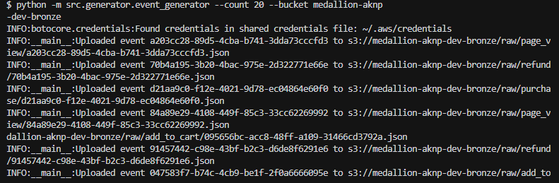
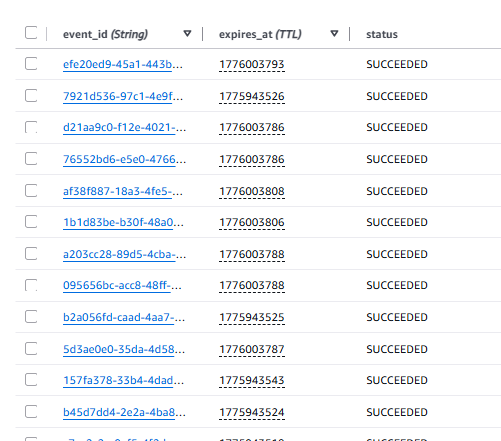
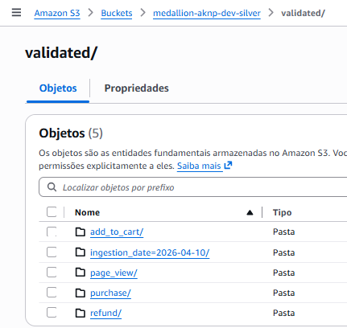
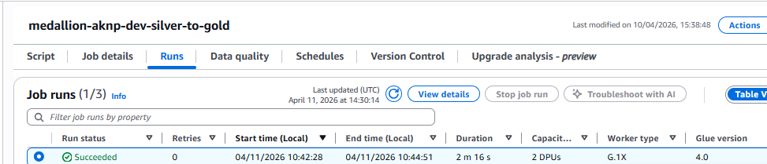
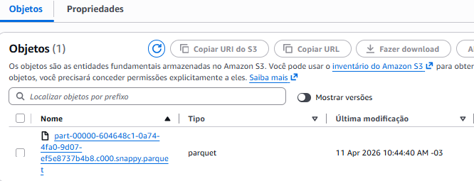
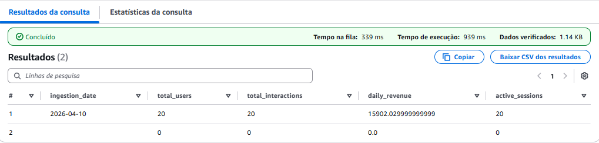

# Pipeline Medallion Serverless na AWS (V1 MVP)

🌎 *For the English version of this document, [click here](./README.md).*

Este repositório contém um pipeline de Engenharia de Dados totalmente serverless e orientado a eventos construído na AWS. Ele implementa a Arquitetura Medallion (Bronze, Silver, Gold) lidando com ingestão de dados, validação, idempotência e processamento ETL, culminando em métricas de negócio acionáveis via banco de dados analítico.

> **🚀 Nota de Evolução:** Esta é a documentação da Arquitetura V1.0.0 (SQS + Lambda + Glue). A evolução para a V2, incorporando *Kinesis Data Firehose*, *AWS Step Functions* e integração com *Snowflake* (Snowpipe), está atualmente em desenvolvimento ativo.

## 🏗️ Design da Arquitetura (V1)

A infraestrutura segue os princípios de melhores práticas do *AWS Well-Architected Framework*, enfatizando uma abordagem 100% Serverless e o princípio KISS (*Keep It Simple, Stupid*).

1. **Ingestão (Bronze):** Um script gerador em Python envia eventos JSON brutos, simulando um e-commerce, para uma fila **AWS SQS**.
2. **Validação e Roteamento (Silver):** Uma função **AWS Lambda** consome a fila, valida a estrutura dos dados usando a biblioteca **Pydantic**, garante a idempotência através do **Amazon DynamoDB** (bloqueando o reprocessamento de eventos duplicados) e roteia os eventos válidos para o bucket S3 da camada Silver, particionados por tipo de evento.
3. **ETL e Agregação (Gold):** Um job **AWS Glue** (PySpark) lê os dados da camada Silver, padroniza os tipos, agrega as métricas financeiras e salva o resultado no formato otimizado `Parquet` no bucket Gold, utilizando particionamento por data de ingestão (*Event Time*).
4. **Analytics:** O **Amazon Athena** é utilizado para consultar as tabelas externas da camada Gold através do *AWS Glue Data Catalog*, disponibilizando os dados para consumo de BI.

## 📸 Provas de Execução e Validação do Pipeline

Abaixo está a documentação visual comprovando a execução de ponta a ponta e a resiliência do pipeline na nuvem.

<b>1. Geração de Eventos e Ingestão (SQS)</b>

 
Execução do script Python local enviando payloads simulados (Compras, Visualizações de Página, Carrinho, Reembolsos) para a fila SQS na AWS.
  

<b>2. Controle de Idempotência (DynamoDB)</b>

 
A função Lambda registra cada `event_id` processado com uma regra de expiração (TTL). O status `SUCCEEDED` comprova que eventos duplicados são ativamente bloqueados.
  

<b>3. Camada Silver (Roteamento de Dados no S3)</b>

 
Eventos validados pelo Pydantic são roteados com sucesso para suas respectivas pastas de domínio (ex: `add_to_cart`, `purchase`) no bucket Silver.
  

<b>4. Processamento ETL (AWS Glue / PySpark)</b>

 
O job Serverless do Apache Spark transformando os JSONs aninhados em métricas agregadas de negócio, executado com sucesso e sem falhas de memória.
  

<b>5. Camada Gold (Parquet Otimizado)</b>

 
Os dados chegam fisicamente ao bucket Gold, compactados com o algoritmo Snappy (Parquet) e perfeitamente particionados pelo Horário Original do Evento (`ingestion_date`).
  

<b>6. Business Analytics (Amazon Athena)</b>

 
A validação final. Consultar a camada Gold via Athena produz métricas de negócios precisas (Receita Diária, Sessões Ativas, Total de Usuários) com latência de milissegundos e sem a necessidade de um servidor de banco de dados dedicado.
  

---
### Stack Tecnológica
* **Cloud:** AWS (SQS, Lambda, DynamoDB, S3, Glue, Athena)
* **Infraestrutura como Código:** Terraform
* **Linguagens:** Python (Boto3, Pydantic, PySpark), SQL

---
## 👩‍💻 Autora
**Ana Kellen Nogueira Porto** *Desenvolvedora Backend*

